# TARE — what each piece does, and why it exists

> **Note.** `LIMITS.md` and `HONESTY.md`, cited below, are not included in this repository.

This document answers one question per section: *why is this technology here, and what would be
lost by removing it?* Every figure quoted was read off the repository, not estimated.

---

## 0. The problem, in one sentence

A Uniswap v4 pool can show **0 % fees** — read on chain, in `slot0` — while its hook takes **18 %**
of your swap. Nothing publishes that number. Of the **1,559 distinct hooks** seen initialising
pools over 200,000 Base blocks, **9 emit either of the two events Uniswap's own guide asks them to
emit — 0.58 %** — and what those nine emit is an absolute amount on one past swap, not the rate you
would pay at your size. The other 1,550 emit nothing at all. The official registry describes
**978 entries with 27 fields each, 19 of them booleans, and not one of the 27 is a quantity**: the
only number in the whole record is `chainId`, and it names a network.

TARE measures that number, writes it to a chain, and stops you before you sign.

---

## 1. The whole chain, from a log to a refused signature

```mermaid
flowchart TB
    subgraph MEASURE["① MEASURE — off chain, on a VM"]
        A["Initialize logs<br/>22,896 read"] --> B["census<br/>7,817 pools"]
        B --> C["anvil fork<br/>block 50,614,000"]
        C --> D["quote WITH the hook"]
        C --> E["anvil_setCode<br/>89-byte stub"] --> F["quote WITHOUT the hook"]
        D & F --> G["difference = the take<br/>125,072 measurements"]
    end

    subgraph UNDERSTAND["② UNDERSTAND — sort, connect, read"]
        G --> H["typed graph<br/>143,788 nodes"]
        G --> I["Sourcify sources<br/>2,309 .sol files"]
        H & I --> J["dual RAG<br/>3,591 chunks"]
    end

    subgraph PUBLISH["③ PUBLISH — visible, reusable"]
        G --> K["the instrument<br/>17 panels"]
        G --> L["Hedera attestations<br/>16 written, 99 computed"]
        G --> M["the guard's table<br/>7,817 pools"]
        J --> N["the assistant"]
    end

    subgraph ACT["④ ACT — the only real action"]
        M --> O["MV3 extension<br/>decodes the calldata"]
        O --> P["verdict OK / WARN / BLOCK"]
        P --> Q["Ledger screen<br/>16 screens"]
        Q --> R{{"the transaction<br/>goes, or does not"}}
    end

    style ACT fill:#1a1a1a,stroke:#F6D746,stroke-width:2px
    style R fill:#F6D746,color:#000
```

**Where is the actionable part?** One box only: ④. Everything else produces data. The moment the
product changes something in the world is **when a transaction that would have gone out does not**.

---

## 2. Each technology, and what would be lost without it

### anvil — the virtual machine that makes the counterfactual possible

**Why.** The hook's address is **one of the five fields of the `PoolKey`**. "The same pool without
its hook" does not exist: removing it names a different pool. That is the wall, and it is why
nobody publishes this number.

**What anvil allows.** `anvil_setCode` rewrites the bytecode **at the hook's address**, on a fork
pinned to a block. The `poolId`, the liquidity, `slot0`, the reserves: identical to the bit. The
only thing that changes is the code that runs during the swap.

**Who runs the VM.** We do, locally or in CI. Four forks in parallel produced the corpus in one
night. A reader who wants to check runs their own: `docker compose up -d`.

**Without anvil**: no counterfactual, so no number. It is the one piece with no substitute.

### Uniswap v4 — the subject, not an integration

The stub is **89 bytes** because `Hooks.sol` validates the *returned data*: ≥32 bytes with the
selector echoed back (`:153`), exactly 96 from `beforeSwap` (`:166`), exactly 64 on the delta path
(`:259`). A bare `STOP` would fail. The stub is a nothing that is **protocol-conformant**.

### The execution probe — because quoting is not executing

`V4Quoter` is an `eth_call`: a **simulation**. `SwapProbe.sol` executes a real swap — `unlock`,
`swap`, `settle`, `take` — and reads its own balance.

**Result: 8 pools out of 9 agree to the wei. One diverges** — quoted 3.5669 bps, executed 0.00.
Both legs are printed in `LIMITS.md` §10b.

Without that probe, the thesis rested on the fidelity of a simulator nothing had checked.

### Hedera — three layers, one per use

```mermaid
flowchart LR
    U["an integrator"] -->|"POST /measure"| API
    API -->|"402 + accepts"| U
    U -->|"x402 payment"| F["facilitator<br/>Blocky402"]
    API --> M["measurement<br/>billed per unit"]
    M --> HCS["HCS topic<br/>batch digest"]
    HCS --> MN["mirror node<br/>re-read"]
    G["the corpus"] --> ATT["HookRateAttestations<br/>Hedera EVM"]
    ATT --> R["a router<br/>a wallet"]
    style ATT fill:#1a1a1a,stroke:#F6D746
```

| layer | what it carries | verified |
|---|---|---|
| **x402** | the toll, billed **per measurement**, not per request | yes — **5 settlements**, each re-read on the mirror node, in [`docs/x402-settlements.jsonl`](x402-settlements.jsonl) |
| **HCS** | the digest of each batch, anchored then re-read | yes — message #4, with its consensus timestamp |
| **EVM** | **16 hooks attested on chain**, out of 99 computed — the field the registry does not have | yes — re-read from the chain |

That 16-against-99 gap is published rather than smoothed over:
[`docs/dataset/attestations.json`](dataset/attestations.json) carries both numbers and the corpus
digest they were derived from. **99 is never the figure to quote as written.**

The contract **refuses** `nMeasured == 0`: a hook that was not measured is **absent**, never
present at zero. `latest()` reverts rather than return a struct of zeros indistinguishable from a
measured zero.

### Ledger — the number on a screen the page cannot repaint

The guard builds an EIP-712 message whose fields are its findings. Run against **Speculos with the
official Ethereum app 1.22.3**, the device shows **16 screens** and then signs: `take 689.95 bps`,
`label MEASURED`, `direction 1->0`. Signature `v=28`.

That only works with the **"Raw messages"** setting. Without it the app says *"Blind signing must
be enabled"* — **the wrong setting**, since blind signing makes you sign a hash. Our code has **no
fallback**. See [`OPEN-SOURCE.md`](../OPEN-SOURCE.md) and [`EIP712.md`](../EIP712.md).

A second capture, taken from a **real Base transaction** rather than a hand-written object, is in
[`docs/ledger/ECRANS.md`](ledger/ECRANS.md): there the pool is not in the guard's table, and the
device renders the refusal itself. The string it shows is the one
[`packages/guard/src/ledger.ts`](../packages/guard/src/ledger.ts) emits, verbatim and in
French — `take non mesure — ce n'est pas zero`, "take not measured — this is not zero".

### The two RAGs — and why two, measured

**What the RAG is for.** The assistant has to answer two families of question with nothing in
common:

- *"which ones take the most"* — a **structural** question, whose answer is a set of entities a
  graph traversal computes exactly;
- *"why is the stub 89 bytes"* — a question of **prose**, whose answer is a paragraph.

One haystack (**3,591 chunks**), two classes, three retrievers:

| | graph | vector + header | vector alone |
|---|---|---|---|
| **structural** | **1.000** | 0.051 | 0.040 |
| **semantic** | 0.000 | **0.433** | 0.383 |

**Each scores zero on the other's class.** No embedding model compares numbers; no graph indexes
prose. That is the measured argument for shipping two, and it is measured, not asserted.

Every vector chunk carries a **header derived from the graph** that includes the honest negations:
*"no measurement: never attempted, not zero take"*.

### The assistant — it never produces a number

Two stages: a deterministic planner, and an LLM planner where **`ollama:granite3.3:8b` and
`openai:gpt-4o-mini` race each other**. The first valid answer wins, the others are cancelled, and
the fate of each is published. Measured: **51.8 s in series → 1.8 to 3.6 s**.

The model **chooses what to query**; the product computes. Its actions go through Zod, its sentence
through a number auditor.

---

## 3. The instrument's panels: read, user action, or chain?

The instrument carries **17 panels, `00` to `16`**, declared once in
[`apps/web/src/components/Index.tsx`](../apps/web/src/components/Index.tsx). Fourteen of them paint
from the corpus compiled into the page and need no network at all; three say so when no API is
published.

```mermaid
flowchart TB
    subgraph L["READING DATA — no network"]
        P0["00 · the exit test"]
        P1["01 · the same swap, quoted twice"]
        P2["02 · the registry against the measurement"]
        P5["05 · the record of the selected hook"]
        P7["07 · the raw rows"]
        P11["11 · what is written on chain"]
        P13["13 · proof of execution on the device"]
    end
    subgraph A["NEEDS A SERVER — and says so"]
        P3["03 · which door to take"]
        P8["08 · the graph around the hook"]
        P15["15 · the account"]
    end
    subgraph O["REAL ON-CHAIN ACTION"]
        P16["16 · the replacement door"]
        EXT["MV3 extension"]
        LED["Ledger screen"]
    end
    P2 --> P5 --> P7
    P16 --> EXT --> LED
    style O fill:#1a1a1a,stroke:#F6D746,stroke-width:2px
```

| | panel | nature | why a user wants to see it |
|---|---|---|---|
| **00** | the exit test | read | put 100 in, read what comes back out — the question before any other |
| **01** | the same swap, quoted twice | read | the method itself, on one row |
| **02** | the registry against the measurement | read | the two columns disagree — the whole product in one image |
| **03** | which door to take | needs a server | the only question a real user asks; it says so when no API answers |
| **04** | the permissions, read on chain | local action | paste an address, 14 LEDs light up, **zero RPC and zero backend** — the bits are the address |
| **05** | the record of the selected hook | read | a specific hook, and its file |
| **06** | the size-to-bps profile | read | the take depends on the size — a single figure would lie |
| **07** | the raw rows | read + replay | every row carries its command: you can **refuse to believe us** |
| **08** | the graph around the hook | needs a server | twins, blast radius, disagreements, orphans |
| **09** | the toll, re-read on the mirror node | read | 5 settlements, each confirmed by a source that is not us |
| **10** | who measures: the agent identity | read | the HCS-14 identity, recomputable before you pay |
| **11** | what is written on chain | read | **16 written**, and the 99 computed next to it |
| **12** | an independent source, cross-checked | read | The Graph, used to contradict us rather than confirm us |
| **13** | proof of execution on the device | read | the screens the Ledger rendered, word for word |
| **14** | the other surfaces | read | the 14 tools, and the five ways in |
| **15** | the account | needs a server | the wallet, the session, the keys, the subscription |
| **16** | and elsewhere? the replacement door | action | the transaction it would build instead — and it never sends it |

**Two panels used to be missing, and this document used to say so: the on-chain attestations, and
the guard's proof on a device.** They are `11` and `13` now. What is still true is that the
interception itself — a transaction caught three seconds before signature — lives in the
**extension**, not in the instrument: it is an action you install to witness, not a panel you read.

---

## 4. All the stored data

| weight | content | file | derived? |
|---|---|---|---|
| 86.2 MB | **125,072 measurements** — the evidence | `docs/dataset/measurements.jsonl` | **source** |
| 0.3 MB | 368 measurements of the contested pools | `docs/dataset/measurements-contestes.jsonl` | **source** |
| 21.5 MB | 22,896 raw `Initialize` logs | `docs/dataset/init-logs-200k.json` | **source** |
| 1.7 MB | 7,817 pools in the census | `docs/dataset/pools-liquides-full.json` | **source** |
| 1.2 MB | 978 entries of the official registry | `docs/hooklist-live-20260905.json` | **source** |
| 29 MB | **2,309 verified Solidity files**, fetched from Sourcify — **on disk, no longer versioned**: they are third-party code, and publishing them multiplied the repository's file count by five for a proof `analysis.json` already carries. Each folder keeps its `provenance.json`, and `python3 -m tare.source.cli fetch` brings them all back | `docs/hooks-source/` | fetched |
| 7.3 MB | 112 hooks analysed against their own code | `docs/hooks-source/analysis.json` | derived |
| 188.8 MB | typed graph — 143,788 nodes, 149,904 edges | `engine/tare/graph/data/graph.json` | derived |
| 51.2 MB | vector index — 3,591 chunks, dim 768 | `engine/tare/rag/var/index.jsonl` | derived |
| 20.7 MB | the guard's table — 7,817 pools | `packages/guard/data/table.json` | derived |
| 7.9 MB | the dataset compiled into the instrument | `apps/web/src/data/dataset.json` | derived |
| 3.3 MB | the sweep summary | `docs/dataset/summary.json` | derived |
| < 0.1 MB | 6 one-way pools · 16 attestations written, 99 computed | `one-way.json` · `attestations.json` | derived |

The instrument's dataset is the same 125,072 rows as the corpus, written **by column** rather than
by object: the same stub hash repeated 125,072 times costs one string, not 125,072. That is how it
went from 86 MB to 7.9 MB, and why the page paints in 2.7 s instead of 10.3 s.

**Derived files are not versioned** — three of them weighed 296 MB and one was over GitHub's file
limit. `scripts/regenerate.sh` rebuilds them in dependency order. Versioning a derived file is
precisely what once made the graph publish **ten numbers the dataset had already retracted**.

Graph composition: 125,072 `Measurement` · 8,586 `Token` · 7,817 `Pool` · 1,019 `Hook` ·
978 `RegistryEntry` · 158 `Bytecode` · 158 `Deployer`.

---

## 5. What the product refuses to do

Four labels, **never promoted**: `MEASURED` · `INTERPOLATED` · `NOT_MEASURABLE` · `NOT_QUOTABLE`.
A bounded read, a timeout, a rate limit all give `NOT_MEASURABLE` — never a value, never a zero.

That rule **survives from the Python engine all the way to the Ledger screen** you sign from, and
it is written into the on-chain contract, which reverts rather than write a zero.

`docs/HONESTY.md` lists **nine false findings** this project produced before its
rules were absolute. Five were the same mistake: a bounded read, an invisible bound, a truncated
result that parsed cleanly.
