# TARE — ce que fait chaque brique, et pourquoi elle existe

Ce document répond à une question par section : *pourquoi cette technologie est là, et que
perdrait-on en la retirant ?* Chaque chiffre cité a été relevé sur le dépôt, pas estimé.

---

## 0. Le problème, en une phrase

Un pool Uniswap v4 peut afficher **0 % de frais** — lu sur la chaîne, dans `slot0` — et son hook
t'en prendre **18 %**. Rien ne publie ce nombre : **9 des 1 559 hooks** vus en 200 000 blocs déclarent — 0,58 %, et ce qu'ils déclarent est un montant absolu sur un swap passé, pas le taux qu'on paierait ; les 1 550 autres ne déclarent rien du tout, alors qu'ils ont été déployés en 200 000 blocs
Base n'émet l'événement qu'Uniswap leur demande d'émettre, et le registre officiel décrit
**978 hooks avec 19 champs dont un seul est numérique — `chainId`**.

TARE mesure ce nombre, l'écrit sur une chaîne, et t'arrête avant que tu signes.

---

## 1. La chaîne complète, d'un log à un refus de signature

```mermaid
flowchart TB
    subgraph MESURE["① MESURER — hors chaîne, sur une VM"]
        A["logs Initialize<br/>22 896 lus"] --> B["recensement<br/>7 817 pools"]
        B --> C["fork anvil<br/>bloc 50 614 000"]
        C --> D["cote AVEC le hook"]
        C --> E["anvil_setCode<br/>talon 89 octets"] --> F["cote SANS le hook"]
        D & F --> G["différence = prélèvement<br/>125 072 mesures"]
    end

    subgraph COMPRENDRE["② COMPRENDRE — ranger, relier, lire"]
        G --> H["graphe typé<br/>143 788 nœuds"]
        G --> I["sources Sourcify<br/>2 309 fichiers .sol"]
        H & I --> J["RAG double<br/>3 591 morceaux"]
    end

    subgraph PUBLIER["③ PUBLIER — visible, réutilisable"]
        G --> K["instrument<br/>7 panneaux"]
        G --> L["attestations Hedera<br/>99 hooks on-chain"]
        G --> M["table de la garde<br/>7 817 pools"]
        J --> N["chatbot<br/>23 intentions"]
    end

    subgraph AGIR["④ AGIR — la seule action réelle"]
        M --> O["extension MV3<br/>décode le calldata"]
        O --> P["verdict OK / WARN / BLOCK"]
        P --> Q["écran Ledger<br/>16 champs"]
        Q --> R{{"la transaction<br/>part ou ne part pas"}}
    end

    style AGIR fill:#1a1a1a,stroke:#F6D746,stroke-width:2px
    style R fill:#F6D746,color:#000
```

**Où est l'actionnable ?** Une seule boîte l'est : ④. Tout le reste produit de la donnée. Le
moment où le produit change quelque chose au monde, c'est **quand une transaction qui serait
partie ne part pas**.

---

## 2. Chaque technologie, et ce qu'on perdrait sans elle

### anvil — la machine virtuelle qui rend le contrefactuel possible

**Pourquoi.** L'adresse du hook est **un des cinq champs de la `PoolKey`**. « Le même pool sans son
hook » n'existe pas : le retirer désigne un autre pool. C'est le mur, et c'est pour ça que
personne ne publie ce nombre.

**Ce qu'anvil permet.** `anvil_setCode` réécrit le bytecode **à l'adresse du hook**, sur un fork
épinglé à un bloc. Le `poolId`, la liquidité, `slot0`, les réserves : identiques au bit près. La
seule chose qui change est le code qui s'exécute pendant l'échange.

**Qui fait tourner la VM.** Nous, en local ou en CI. Quatre forks en parallèle ont produit le
corpus en une nuit. Le lecteur qui veut vérifier lance le sien : `docker compose up -d`.

**Sans anvil** : aucun contrefactuel, donc aucun nombre. C'est la brique non substituable.

### Uniswap v4 — le sujet, pas une intégration

Le talon fait **89 octets** parce que `Hooks.sol` valide les *données rendues* : ≥32 octets avec le
sélecteur réécho (`:153`), exactement 96 depuis `beforeSwap` (`:166`), exactement 64 sur le chemin
des deltas (`:259`). Un `STOP` échouerait. Le talon est un néant **conforme au protocole**.

### La sonde d'exécution — parce que coter n'est pas exécuter

`V4Quoter` est un `eth_call` : une **simulation**. `SwapProbe.sol` exécute un vrai swap —
`unlock`, `swap`, `settle`, `take` — et lit son propre solde.

**Résultat : 8 pools sur 9 concordent au wei. Un diverge** — coté 3,5669 bps, exécuté 0,00.

Sans cette sonde, la thèse reposait sur la fidélité d'un simulateur que rien n'avait vérifié.

### Hedera — trois couches, une par usage

```mermaid
flowchart LR
    U["un intégrateur"] -->|"POST /measure"| API
    API -->|"402 + accepts"| U
    U -->|"paiement x402"| F["facilitateur<br/>Blocky402"]
    API --> M["mesure<br/>facturée à l'unité"]
    M --> HCS["topic HCS<br/>empreinte du lot"]
    HCS --> MN["mirror node<br/>relecture"]
    G["corpus"] --> ATT["HookRateAttestations<br/>EVM Hedera"]
    ATT --> R["un routeur<br/>un portefeuille"]
    style ATT fill:#1a1a1a,stroke:#F6D746
```

| couche | ce qu'elle porte | vérifié |
|---|---|---|
| **x402** | le péage, facturé **à la mesure** pas à la requête | le 402 est formé et le facilitateur répond · **aucun règlement n'a abouti** |
| **HCS** | l'empreinte de chaque lot, ancrée puis relue | oui — message #4, horodatage de consensus |
| **EVM** | **99 hooks attestés** — le champ que le registre n'a pas | oui — relu depuis la chaîne |

Le contrat **refuse** `nMeasured == 0` : un hook non mesuré est **absent**, jamais présent à zéro.
`latest()` révèle plutôt que de rendre une structure de zéros qu'on ne saurait distinguer d'une
mesure nulle.

### Ledger — le nombre sur un écran que la page ne repeint pas

La garde construit un EIP-712 dont les champs sont ses constats. Exécuté contre **Speculos avec
l'application Ethereum officielle 1.22.3**, l'appareil affiche **16 écrans** puis signe :
`take 689.95 bps`, `label MEASURED`, `direction 1->0`. Signature `v=28`.

Cela n'aboutit qu'avec le réglage **« Raw messages »**. Sans lui, l'application dit *« Blind
signing must be enabled »* — **le mauvais réglage**, puisque le blind signing fait signer un hash.
Notre code n'a **aucun repli**. Voir [`OPEN-SOURCE.md`](../OPEN-SOURCE.md).

### Les deux RAG — et pourquoi deux, mesuré

**À quoi sert le RAG.** Le chatbot doit répondre à deux familles de questions qui n'ont rien en
commun :

- *« lesquels prennent le plus »* — une question **structurelle**, dont la réponse est un ensemble
  d'entités qu'un parcours de graphe calcule exactement ;
- *« pourquoi le talon fait-il 89 octets »* — une question de **prose**, dont la réponse est un
  paragraphe.

Une seule botte de foin (**3 591 morceaux**), deux classes, trois récupérateurs :

| | graphe | vecteur + en-tête | vecteur seul |
|---|---|---|---|
| **structurel** | **1,000** | 0,051 | 0,040 |
| **sémantique** | 0,000 | **0,433** | 0,383 |

**Chacun est nul sur la classe de l'autre.** Aucun modèle d'embedding ne compare des nombres ;
aucun graphe n'indexe de la prose. C'est l'argument chiffré pour en embarquer deux, et il est
mesuré, pas affirmé.

Chaque morceau vectoriel porte un **en-tête dérivé du graphe** qui inclut les négations honnêtes :
*« aucune mesure : jamais tenté, pas zéro prélèvement »*.

### Le chatbot — il ne produit jamais un nombre

Deux étages : un planificateur déterministe et un planificateur LLM où **`ollama:granite3.3:8b` et
`openai:gpt-4o-mini` courent ensemble**. La première réponse valide gagne, les autres sont
annulées, et le sort de chacune est publié. Mesuré : **51,8 s en série → 1,8 à 3,6 s**.

Le modèle **choisit quoi interroger** ; le produit calcule. Ses actions passent par Zod, sa phrase
par un auditeur de nombres.

---

## 3. Les 7 panneaux : lecture, action, ou chaîne ?

```mermaid
flowchart TB
    subgraph L["LECTURE DE DONNÉE — aucun réseau"]
        P1["01 · le verdict"]
        P2["02 · registre vs mesure"]
        P3["03 · 14 permissions"]
        P5["05 · profil taille → bps"]
        P6["06 · les lignes brutes"]
    end
    subgraph A["ACTION DE L'UTILISATEUR"]
        P4["04 · fiche hook"]
        P7["07 · par quelle porte passer"]
        CH["le chat — 23 intentions"]
    end
    subgraph O["ACTION ON-CHAIN RÉELLE"]
        EXT["extension MV3"]
        LED["écran Ledger"]
        ATT["attestations"]
    end
    P2 --> P4 --> P5 --> P6
    CH --> P1 & P2 & P3 & P4 & P5 & P6 & P7
    P7 --> EXT --> LED
    style O fill:#1a1a1a,stroke:#F6D746,stroke-width:2px
```

| | panneau | nature | pourquoi l'utilisateur veut le voir |
|---|---|---|---|
| **01** | le verdict | **lecture** | il doit comprendre le problème en 5 secondes, sans wallet, sans clic |
| **02** | registre vs mesure | **lecture** | les deux colonnes ne sont pas d'accord — c'est tout le produit en une image |
| **03** | 14 permissions | **action locale** | il colle son adresse, 14 diodes s'allument, **zéro appel réseau** : il vérifie que l'outil ne le piste pas |
| **04** | fiche hook | **action** | il a un hook précis en tête et veut son dossier |
| **05** | profil taille → bps | **lecture** | le prélèvement dépend de la taille — un chiffre unique mentirait |
| **06** | lignes brutes | **lecture + rejeu** | chaque ligne porte sa commande : il peut **ne pas nous croire** |
| **07** | par quelle porte | **action** | la seule question qu'un utilisateur réel pose |
| **+** | le graphe | **lecture** | jumeaux, rayon d'impact, désaccords, orphelins |

**Réponse franche : non, ces 7 panneaux ne couvrent pas tout.** Il en manque deux.

**Ce qui manque — 08, la garde en action.** Le panneau qui montre une transaction interceptée, le
verdict, et le refus. C'est **l'actionnable**, et il n'a pas de surface dans l'instrument : il vit
dans l'extension. Un juge voit sept panneaux de lecture et une action qu'il doit installer pour
constater.

**Ce qui manque — 09, les attestations on-chain.** 99 hooks écrits sur Hedera, lisibles par un
contrat, et rien à l'écran ne le montre.

---

## 4. Toutes les données stockées

| poids | contenu | fichier | dérivé ? |
|---|---|---|---|
| 86,2 Mo | **125 072 mesures** — la preuve | `docs/dataset/measurements.jsonl` | **source** |
| 0,3 Mo | 368 mesures des 8 paires à plusieurs pools | `docs/dataset/measurements-contestes.jsonl` | **source** |
| 21,5 Mo | 22 896 logs `Initialize` bruts | `docs/dataset/init-logs-200k.json` | **source** |
| 1,7 Mo | 7 817 pools recensés | `docs/dataset/pools-liquides-full.json` | **source** |
| 1,2 Mo | 978 fiches du registre officiel | `docs/hooklist-live-20260905.json` | **source** |
| 29 Mo | **2 309 fichiers Solidity** vérifiés, récupérés sur Sourcify | `docs/hooks-source/` | **source** |
| 7,3 Mo | 112 hooks analysés depuis leur code | `docs/hooks-source/analysis.json` | dérivé |
| 188,8 Mo | graphe typé — 143 788 nœuds, 149 904 arêtes | `engine/tare/graph/data/graph.json` | dérivé |
| 51,2 Mo | index vectoriel — 3 591 morceaux, dim 768 | `engine/tare/rag/var/index.jsonl` | dérivé |
| 20,7 Mo | table de la garde — 7 817 pools | `packages/guard/data/table.json` | dérivé |
| 87,4 Mo | jeu embarqué par l'instrument | `apps/web/src/data/dataset.json` | dérivé |
| 3,3 Mo | résumé du balayage | `docs/dataset/summary.json` | dérivé |
| < 0,1 Mo | 6 pools à sens unique · 99 attestations | `one-way.json` · `attestations.json` | dérivé |

**Les dérivés ne sont pas versionnés** — trois pesaient 296 Mo et l'un dépassait la limite de
GitHub. `scripts/regenerate.sh` les reconstruit dans l'ordre. Versionner un fichier dérivé est
précisément ce qui avait fait publier au graphe **dix nombres que le jeu avait déjà retirés**.

Composition du graphe : 125 072 `Measurement` · 8 586 `Token` · 7 817 `Pool` · 1 019 `Hook` ·
978 `RegistryEntry` · 158 `Bytecode` · 158 `Deployer`.

---

## 5. Ce que le produit refuse

Quatre étiquettes, **jamais promues** : `MEASURED` · `INTERPOLATED` · `NOT_MEASURABLE` ·
`NOT_QUOTABLE`. Une lecture bornée, un délai, une limite de débit donnent `NOT_MEASURABLE` —
jamais une valeur, jamais un zéro.

Cette règle **survit du moteur Python jusqu'à l'écran Ledger** depuis lequel tu signes, et elle est
gravée dans le contrat on-chain, qui révèle plutôt que d'écrire un zéro.

[`docs/HONESTY.md`](HONESTY.md) recense **neuf faux résultats** que ce projet a produits avant que
ses règles soient absolues. Cinq étaient la même faute : une lecture bornée, une borne invisible,
un résultat tronqué qui s'analysait proprement.
